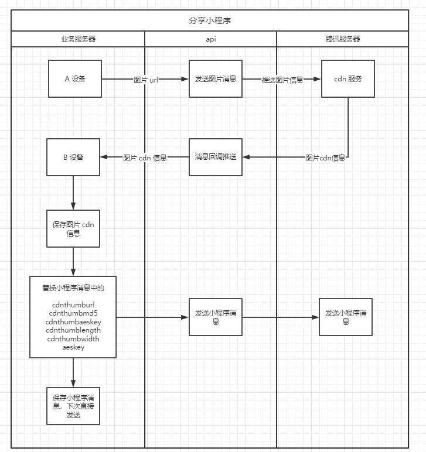

#### 网关地址


<font style="background:#F8CED3;color:#70000D">POST</font>** **[**<font style="color:#000000;">http://网关地</font>****<font style="color:#000000;">址</font>**](http://域名/member/login)**<font style="color:#000000;">/open/sendApp</font>**


#### 请求header
| **名称** | **类型** | **填写** | **默认值** | **说明** |
| --- | --- | --- | --- | --- |
| Authorization | string | 是 |  | API平台认证信息 |


#### 请求body
| **名称** | **类型** | **填写** | **默认值** | **说明** |
| --- | --- | --- | --- | --- |
| <font style="color:#364149;">deviceId</font> | string | 是 |  | 设备标识（创建设备时提供的唯一值） |
| wxId | string | 是 | 88@chatroom | 接收人（微信id <font style="color:#DF2A3F;">通常以 wcid 开头</font>或者群号<font style="color:#DF2A3F;">通常以 @chatroom 结尾</font>） |
| <font style="color:#364149;background-color:#FFFFFF;">content</font> | string | 是 |  | 小程序xml回调, (此回调的XML需要去掉部分，截取appmsg开头的，具体请看默认值） |


#### 响应数据<font style="background:#F8CED3;color:#70000D">数据格式：JSON</font>
```json
{
    "message": "发送成功",
    "code": "1000",
    "data": " "
}
```

#### 小程序消息参考模板
提示： 获取小程序可以把小程序发给自己或者<font style="color:#F5222D;">发给文件传输助手</font>，然后用消息接收接口收取小程序参数，发送的时候需要将转义符去掉。

```xml
<appmsg appid="" sdkver="0"> <title>微信发票助手</title> <des>微信发票助手</des> <action /> <type>33</type> <showtype>0</showtype> <soundtype>0</soundtype> <mediatagname /> <messageext /> <messageaction /> <content /> <contentattr>0</contentattr> <url>https://mp.weixin.qq.com/mp/waerrpage?appid=wx1af4f6aa3a537c1a&amp;type=upgrade&amp;upgradetype=3#wechat_redirect</url> <lowurl /> <dataurl /> <lowdataurl /> <songalbumurl /> <songlyric /> <appattach> <totallen>0</totallen> <attachid /> <emoticonmd5></emoticonmd5> <fileext /> <cdnthumburl>30580201000451304f0201000204502c9b9f02032f55f90204700260b402045ee0a378042a777875706c6f61645f777869645f796c7874666c63673070386232323135305f313539313738303231360204010400030201000400</cdnthumburl> <cdnthumbmd5>5b2f61d8de9225bdf30b3f79e1eb6fda</cdnthumbmd5> <cdnthumblength>31323</cdnthumblength> <cdnthumbwidth>720</cdnthumbwidth> <cdnthumbheight>576</cdnthumbheight> <cdnthumbaeskey>5037f41adc0aac2d74453172cb8f41b4</cdnthumbaeskey> <aeskey>5037f41adc0aac2d74453172cb8f41b4</aeskey> <encryver>0</encryver> <filekey>wxid_ylxtflcg0p8b22150_1591780216</filekey> </appattach> <extinfo /> <sourceusername>gh_3610de7f9728@app</sourceusername> <sourcedisplayname>微信发票助手</sourcedisplayname> <thumburl /> <md5 /> <statextstr /> <directshare>0</directshare> <weappinfo> <username><![CDATA[gh_3610de7f9728@app]]></username> <appid><![CDATA[wx1af4f6aa3a537c1a]]></appid> <type>2</type> <version>60</version> <weappiconurl><![CDATA[http://mmbiz.qpic.cn/mmbiz_png/JCC5IkKbGqyezFTbGLPCHiciaZGNnCq7CEKlMV8icrjrA1jnIW50NYSIGl0rMCx8d8PNKxNrWiallt7l7qo8nW1iaWQ/640?wx_fmt=png&wxfrom=200]]></weappiconurl> <pagepath><![CDATA[pages/index/index.html]]></pagepath> <shareId><![CDATA[0_wx1af4f6aa3a537c1a_5a36c4cc14fb8effefecbd92a1f291a6_1591780216_0]]></shareId> <appservicetype>0</appservicetype> <tradingguaranteeflag>0</tradingguaranteeflag> </weappinfo> </appmsg> <fromusername>wxid_i6qsbbjenjuj22</fromusername> <scene>0</scene> <appinfo> <version>1</version> <appname /> </appinfo> <commenturl />
```

#### 替换封面图
替换小程序封面图可参考下图的流程，该流程需要创建两个设备配合。



