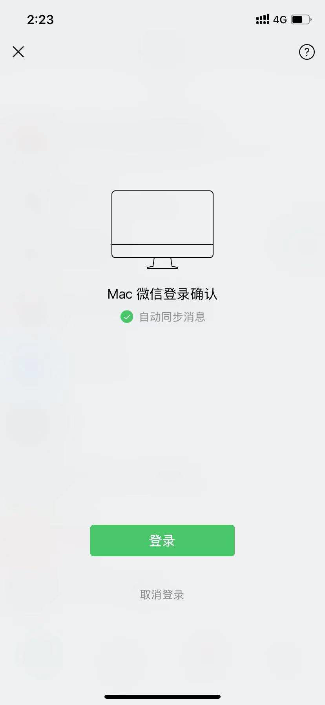

<font style="color:#000000;">接口用途：</font>**调用此接口后，手机微信上会弹出登录确认框，用户无需扫码，可以直接确认登录**

**<font style="color:#F5222D;">⚠️</font>****<font style="color:#F5222D;"> 超过 20 天未登录的设备，系统会自动回收，回收后的设备，再次登录时，需要重置设备</font>**

⚠️ 注意：掉线尽量用二次登录接口（本接口） 这样保持常用设备登录，二次登录失败不能唤起微信登录确认的情况下再调用 第三步 扫码登录接口

⚠️  多次二次登录不确认，二次登录超时未确认，长时间未登录，ip 跨度太大等情况，二次登录会被拒绝，此时需使用扫码登录接口获取二维码重新扫码登录。


#### 网关地址
<font style="background:#F8CED3;color:#70000D">POST</font>** http://****网关地址/open/loginAgain**

****

**使用流程**

请注意，如果 3 分钟后用户仍未成功登录，二次登录会自动失效，此时需重新获取二维码进行登录，开发者可参考 PC 端二次登录流程。


#### 请求header
| **名称** | **类型** | **填写** | **默认值** | **说明** |
| --- | --- | --- | --- | --- |
| Authorization | string | 是 |  | API平台认证信息 |


#### 请求body
| **名称** | **类型** | **填写** | **默认值** | **说明** |
| --- | --- | --- | --- | --- |
| <font style="color:#364149;background-color:#FFFFFF;">deviceId</font> | string | 是 |  | 设备标识（创建设备时提供的唯一值） |


#### 响应数据<font style="background:#F8CED3;color:#70000D">数据格式：JSON</font>
```json
{
    "message": "成功",
    "code": "1000",
    "data": {
        "wcId": "wxid_xxxxxxx",
        "wId": "微信实例ID",
        "wAccount": "alibba888",
        "country": "CN",
        "city": "Beijing",
        "signature": "大家有问题可以找我",
        "nickName": "售前客服",
        "sex": 2,
        "headUrl": "http://wx.qlogo.cn/mmhead/ver_1/7",
        "smallHeadImgUrl": "http://wx.qlogo.cn/mmhead/ver_1/",
        "status": 3
    }
}
```

#### 响应书数据参数说明
| **名称** | **类型** | **填写** | **默认值** | **说明** |
| --- | --- | --- | --- | --- |
| wcId | string | 是 | wxid_xxxx | 微信原始id |
| wId |  |  |  | 微信实例ID |
| wAccount | string | 是 |  | 微信号 |
| country |  |  | CN | 城市代号 |
| city |  |  |  | 城市 |
| signature |  |  |  | 个性签名 |
| nickName |  |  |  | 昵称 |
| sex |  |  |  | 性别 |
| headUrl |  |  |  | 头像（高清大图） |
| smallHeadImgUrl |  |  |  | 小头像 |
| status |  |  |  | 无须理会 |


#### 备注说明
1. **首次登录平台的微信号**调用登录获取二维码和执行微信登录接口即可，以后再次登录，调用二次登录接口或者传wcid获取二维码扫码登录（防封号，防掉线）
2. 假如微信掉线或者手动下线后，直接调用此接口登录即可
3. 不需要扫码，只需要手机**微信点击确认登录**就好



