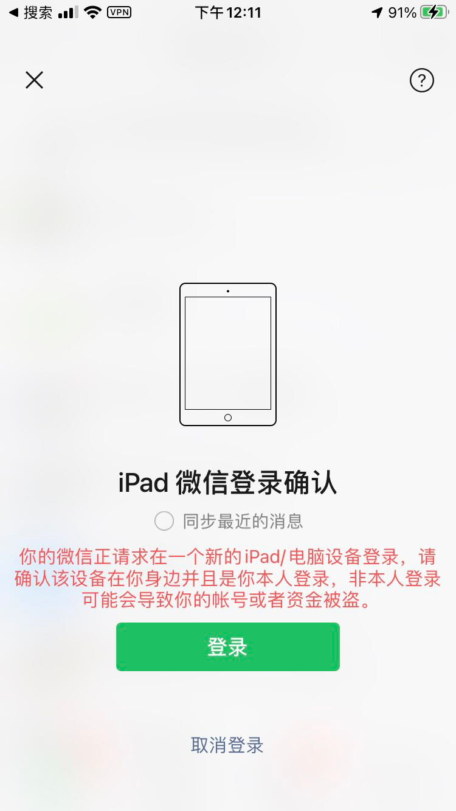

**<font style="color:#F5222D;">⚠️</font>****<font style="color:#F5222D;"> 用户登录成功后以及扫码期间，请勿重新获取二维码，否则可能被判断为登录环境异常，引发风控。</font>**

**<font style="color:#F5222D;">⚠️</font>****<font style="color:#F5222D;">  在第一次登录成功后，后续再次登录某个号的时候，请调用二次登录接口进行登录。</font>**

**<font style="color:#F5222D;">⚠️</font>****<font style="color:#F5222D;">  </font>****<font style="color:#F5222D;">如遇二次登录接口报错，方可再次调用本接口进行登录，这样做是为了保证</font>****<font style="color:#F5222D;">登录</font>****<font style="color:#F5222D;">在常用设备上。</font>**

**<font style="color:#F5222D;">⚠️⚠️⚠️</font>****<font style="color:#F5222D;">：</font>****<font style="color:#F5222D;">登录</font>****<font style="color:#F5222D;">设备后再</font>****<font style="color:#F5222D;">登录</font>****<font style="color:#F5222D;">pc客户端或者其他副设备会被挤下工位，请不要</font>****<font style="color:#F5222D;">登录</font>****<font style="color:#F5222D;">其他设备（手机上正常在线）</font>**

**<font style="color:#F5222D;">⚠️</font>****<font style="color:#F5222D;">  微信已对部分账号开放 pad 与 电脑端同时在线，该部分账号可以登录本服务的同时，登录电脑端，本服务不会掉线。未获得双端在线权限的账号，请等待微信完全放开该限制。</font>**

**<font style="color:#F5222D;">⚠️</font>****<font style="color:#F5222D;"> 超过 20 天未登录的设备，系统会自动回收，回收后的设备，再次登录时，需要重置设备</font>**

#### 网关地址
<font style="background:#F8CED3;color:#70000D">POST</font>** http://网关地址/open****/getLoginQrCode**

获取微信登录二维码，进行扫码登录

<font style="color:#F5222D;">扫码之后必须调用第四步确认登录接口，才能完成登录。</font>

<font style="color:#F5222D;">扫码之后必须调用第四步确认登录接口，才能完成登录。</font>

<font style="color:#F5222D;">扫码之后必须调用第四步确认登录接口，才能完成登录。</font>

#### 请求header
| **名称** | **类型** | **填写** | **默认值** | **说明** |
| --- | --- | --- | --- | --- |
| Authorization | string | 是 |  | API平台认证信息 |


#### 请求body
<font style="background:#F8CED3;color:#70000D">提示</font>：<font style="color:#E8323C;">2022年07月22日更新，由于微信登录风控升级，今起登录必须传递同省/同城代理，否则微信会秒掉，且频繁登录会限制扫码功能，真机一样，请务必使用ttuid，代理，或传入省市（三选一即可）。</font>

<font style="color:#E8323C;">扫码登录时，如遇提示异地登录且登录城市非本省，可能会出现秒掉（扫码登录后没有成功登录），此情况下请勿重复尝试扫码登录，并在使用同省/同市代理取码后再次登录。</font>

<font style="color:#E8323C;"></font>

| **名称** | **类型** | **必须** | **默认值** | **说明** |
| --- | --- | --- | --- | --- |
| <font style="color:#364149;background-color:#FFFFFF;">deviceId</font> | string | 是 |  | 设备标识（创建设备时提供的唯一值） |
| province | string | 是 | | 用户所在省份，传入时优先分配同省设备，示例：广东 或 广东省 |
|  city | string | 否 | | 用户所在城市，传入时优先分配同城设备，示例：广州 或 广州市 |
| deviceType | string | 否 | | 默认不传递，如果登录扫码后出现新设备验证或多次扫码无法登录，则设置该值为 mac，若登录成功，则后续登录需继续传递该值为 mac |
| proxyIp | string | 否 |  | 代理IP地址，需要支持<font style="color:#364149;">Socks5</font> |
| proxyUser | string | 否 |  | 代理ip账号 |
| proxyPassword | string | 否 |  | 代理IP密码 |


#### 响应数据<font style="background:#F8CED3;color:#70000D">数据格式：JSON</font>
```json
{
    "code": "1000",
    "message": "处理成功",
    "data": {
        "qrCodeUrl": "登录二维码地址链接"
    }
}
```

#### 响应书数据参数说明
| **名称** | **类型** | **填写** | **默认值** | **说明** |
| --- | --- | --- | --- | --- |
| qrCodeUrl | string | 是 |  | 微信登录二维码地址 |


#### 备注说明
+ <font style="color:#FA541C;">调用本接口得到二维码图片地址</font>
+ <font style="color:#FA541C;">开发者将本接口</font>**<font style="color:#FA541C;">返回的二维码让用户去扫码</font>**
+ **<font style="color:#FA541C;">扫码结束后，</font>**[**<font style="color:#FA541C;">执行登录接口</font>**](https://docs.wkteam.cn/api-wen-dang/kai-shi-kai-fa/untitled)**<font style="color:#FA541C;">（也就是第四步接口）会返回登录成功或者登录失败</font>**
+ <font style="color:#FA541C;">注意：请求所有</font>**<font style="color:#FA541C;">接口</font>**<font style="color:#FA541C;">需在</font>**<font style="color:#FA541C;">header包裹Authorization(必须)</font>**
+ **<font style="color:#FA541C;">首次登录，或长时间未登录，或重置过设备，或用户在手机上把登录设备记录删除，微信会判定当前设备非常用可信设备，此时扫码会出现如下图的新设备提示，新设备 24 （部分账号 72）小时内不能发送朋友圈，且 24 小时内必定掉线一次。</font>**



