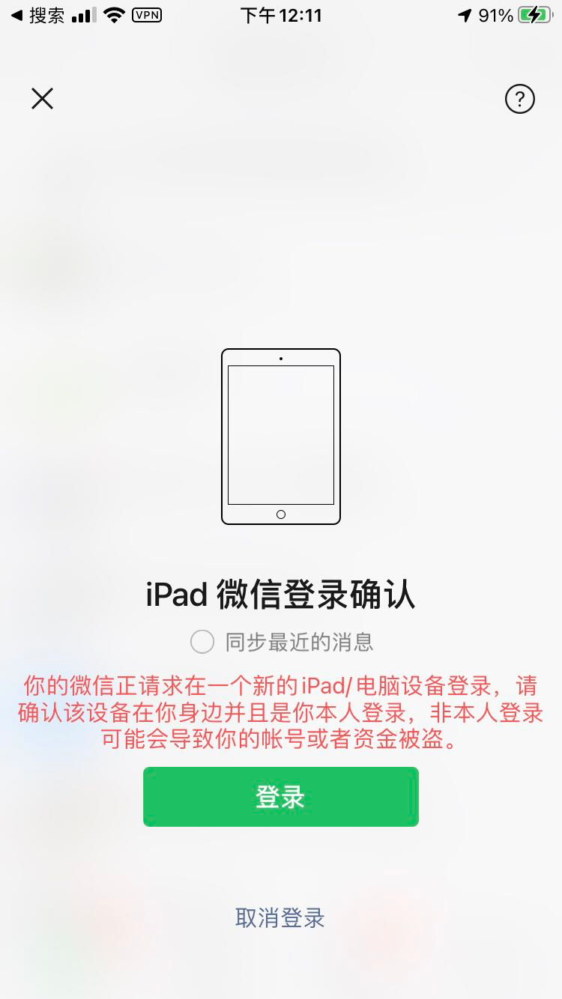

#### 此章节不定期更新，请持续关注

#### ⚠️ 接口调用注意事项
提示

1. 对接接口前，请务必查看接口文档内标红的注意事项，可以让你避免 90% 以上的错误。
2. 询问技术问题时，请务必带上请求参数提问，以便技术人员复现问题，提高对接效率。
3. 每个微信号在调用相同接口时，至少间隔 1 秒。尽量让业务状态**显得正常，**

**比如：**群发消息，每个账号 1 秒 1 条是正常合理的，每个账号 1 秒 3 条就是不合理的行为。

   不合理的行为可能导致触发风控导致账号掉线，甚至封禁。

4. **每日凌晨 3 点 0 分 - 15 分，服务器会进行例行自检，届时可能会出现少量的请求失败，属于正常情况，请避免在此时段进行业务，或对此时段的业务请求进行额外的重试处理。**
5. 短时间内需要大量上号（单日500个以上），请务必至少提前 3 小时告知客服，以便我们安排技术和其它资源保证您业务的稳定。
6. 接口有一定概率失败，请调用方注意重试。
    - 消息类接口建议第一次重试间隔5秒，第二次重试间隔30秒，第三次重试间隔60秒
    - 朋友圈类接口建议第一次重试间隔1分钟，第二次重试间隔3分钟，第三次重试间隔5分钟

#### 部分风控规则说明：

提示 以下说明标红部分均为强制要求

1. 请严格遵循一设备一号的规范使用本服务，如需更换微信号，请确保已调用重置设备接口进行设备重置，或直接使用新设备（原有设备不使用不会继续产生费用）。因为一设备登录多号导致的连带风控甚至封号等一切后果自负。
2. 未绑定银行卡、未实名认证、注册使用时间低于3个月，已被封禁过，不活跃的账号，均为高危账号，请勿使用本服务，如使用本服务造成任何后果自负。
3. 本服务不开发，不提供任何与资金（红包，转账等）相关的接口
4. 使用本服务进行登录均为副设备登录，使用账号密码进行登录的为主设备，副设备大概率 24 小时内掉线一次（防盗号机制），为正常现象，二次登录即可。
5. 因受微信风控规则变更影响，新设备登录 72 小时（3天）内不能进行发朋友圈，获取群聊二维码，搜索好友，添加好友，拉人进群，删除好友等操作。
6. 为了账号稳定，推荐登录新设备（重置后的设备同视为新设备）后进行 3 - 5 小时的挂机养号操作，在此时间段内限制或者禁止操作，以提高设备的稳定性，可以避免很多风控。
    1. 默认登录使用设备所在地 ip（绝大部分是深圳），部分账号异地登录可能会出现防盗号安全机制（表现为登录后秒掉线，部分账号手机上需要重新输入密码进行登录），如需避免风控，可为设备提供同城 socks5 代理，可解决 80% 以上的风控，让账号更稳定：[如何设置网络代理](https://www.yuque.com/wechatpro/wxapi/kivgn8)
7. 发朋友圈每条间隔建议10分钟以上 / 条，单天建议不超过 100 条，点赞和评论建议间隔为 3~5s， 单天上限为500 次，获取朋友圈间隔为 5s 以上，单天上限为 200 次
    1. 如短时间内发布多条带有金融，理财，交易，区块链，资金，账户等等与金融相关的朋友圈，账户将被视为高风险账号。（一天多条，多天连续，均在此风控范围内，发布金融相关内容，请谨慎）
    2. 微信已对同质化内容进行监控，连续频繁发送相似朋友圈的，将被视为营销号（提示骚扰/虚假营销/欺诈）
8. 主动添加好友单天上限为 15 个，扫码方式添加和通过好友请求上限为 25 个，1 小时内上限为 5 个，超过上限时，无法发出好友请求，也收不到好友请求
    1. 连续多天触发添加好友上限，将被视为风险账号
9. 发送消息 1 分钟内不能超过 40 条，给相同对象（同一个好友，同一个群）发消息时，建议间隔为 1 ~ 3s / 条，给不同对象（不同的群，不同的好友）发消息时，每个对象之间建议间隔为 3 ~ 5s。转发消息时，不限制发送间隔，消息发送不允许并发，请务必做好发送间隔限制。
    1. 微信已对同质化内容进行监控，连续多天频繁对好友或群聊发送类似的内容，将被视为营销号（可导致：发送消息其它人看不到，别人延迟收到，收不到别人的信息，微信团队提示骚扰/虚假营销/欺诈等，请降低发送频率，更换话术，养号或换号）
    2. 连续多天发送含有金融，理财，交易，区块链，资金，账户等等与金融相关的信息，账户将被视为高风险账号。
    3. 群发类，循环发送等功能优先使用转发消息接口来发送：文件，视频，链接，图片等类型消息，转发消息可以大大加快发送速度，提高发送成功率，并避免因为发送大量消息而触发流量限制等风控。
    4. 转发消息单天上限为 300 - 500 条，因号而异，主设备通常比副设备拥有更高的阈值，副设备触发转发上限后，主设备仍能转发消息属于正常情况。
    5. 淘客类客户需注意，发送消息数量超过一定阈值后（具体阈值视账号而定），会触发消息审核，出现消息丢失，消息延迟，无法收到消息回调等。请限制每个账号的发单频率以及发单数量。
10. 创建群聊单天上限为 10~15 个，且两次创建群聊的间隔不要低于 10 分钟，频繁建群，或频繁拉人入群是极度高危操作，建议使用主设备进行创建群聊。新群不建议直接拉人，可使用多个机器人在群里随意发几天消息后再拉人，新号建议 1 小时内拉人数不要超过 6 个，老号可适当放宽，但不宜超过 15 个。
    1. 新登录账号3天内不建议创建群聊。
    2. 新登录账号3天内无法获取群聊二维码。
    3. 连续多天创建群聊，且群聊总数超过20个的，视为营销账号
11. 下载图片，视频等，需在消息收到后 1s 后进行下载，每次下载之间间隔需超过 3s，失败重试间隔最低 1s， 每条消息请只下载一次，多次下载有一定风险，需要永久保存的文件请自行保存，下载链接仅 3 天有效。
12. 定时业务请注意让定时任务有一定的时间波动，太规律的行为在风控严格时期，可能会被警告。
13. 活跃度较低的账号更容易被风控，提高活跃度的方式如下：
    1. 有计划的添加数名好友，并偶尔互发消息互动
    2. 给其它人的朋友圈点赞，留评
    3. 关注公众号，并查看文章
    4. 使用微信支付
14. **首次登录，或长时间未登录，或重置过设备，或用户在手机上把登录设备记录删除，微信会判定当前设备非常用可信设备，此时扫码会出现如下图的新设备提示，新设备 24 （部分账号 72）小时内不能发送朋友圈，且 24 小时内必定掉线一次。**

                                

